# Liens utiles

[Télécharger NodeJS](https://nodejs.org/en/download/)  
[Télécharger Visual Studio Code](https://code.visualstudio.com/)

[Lien de l'API Zomato](https://developers.zomato.com/api?lang=en)  
[Documentation API Fetch](https://developer.mozilla.org/fr/docs/Web/API/Fetch_API/Using_Fetch)

[Documentation de React Native](https://facebook.github.io/react-native/)  
[Documentation des composants React Native](https://facebook.github.io/react-native/docs/components-and-apis.html#basic-components)  
[Documentation Flexbox ReactNative](https://facebook.github.io/react-native/docs/flexbox)  
[Documentation de la FlatList React Native](https://facebook.github.io/react-native/docs/flatlist.html)  
[Documentation des Hooks React Native](https://fr.reactjs.org/docs/hooks-intro.html)

[Documentation de react-navigation](https://reactnavigation.org/docs/en/getting-started.html)

[Feuille récap des propriétés pour les styles](https://github.com/vhpoet/react-native-styling-cheat-sheet)

# Get started - CRNA

## Les outils

Installez **Node.js** (LTS)

Installez **Expo** :

```
npm install -g expo-cli
```

Si vous souhaitez utiliser l'émulateur Android, installez AndroidStudio

Installez un **éditeur de texte** pour développer en JavaScript. Je recommande Visual Studio Code mais vous êtes libre de choisir une autre solution (Atom, IntelliJ...)

Sur votre téléphone / la tablette, téléchargez **l'application Expo**.
Passez le téléphone en mode développeur

## Création du projet

Créez un dossier pour le projet. Dans ce dossier, créez le projet :

```
expo init Restaurants
```

Template : blank

## Lancer l'application

Placez-vous dans un terminal, dans le dossier de votre projet

```
expo start
```

Si vous êtes sur le même réseau WiFi, scannez le QR code avec Expo depuis la tablette  
Sinon passez en premier en mode tunnel dans l'interface web ouverte par Expo, puis scannez le QR code

## Menu des options de debug

Pour ouvrir le menu d'options de debug, secouez l'appareil

## Live reloading

Pas besoin de compiler du JS. Une application React Native se recharge dès que vous faites un changement  
Dans le fichier _App.js_, modifiez

```
<Text>Open up App.js to start working on your app!</Text>
```

par

```
<Text>Bonjour à vous les GI</Text>
```

puis sauvegardez. L'application est re-rendu et le changement s'affiche à l'écran

# Application restaurant

## Premier composant custom

Un composant = un fichier (pour mieux les réutiliser dans notre application)  
Créez un dossier _src_, puis un dossier _components_, puis le fichier _Search.js_ (par convention, on nomme un fichier contenant un composant avec une majuscule)  
Chemin final : src/components/Search.js

Il existe 2 façons pour écrire un composant : l'écrire sous forme de **class** ou sous forme de **function**.

```
import React from 'react';

//Sous forme de class :

class Search extends React.Component {
  render() {
    return (

    );
  }
}

//Sous forme de function :

const Search = () => {
  return (

  );
}
```

Jusqu'à Mars 2019, je vous aurai fortement conseillé d'utiliser la forme de **class** (car cela permet de conserver un état, on verra cela plus tard). Mais depuis cette date les _Hooks_ nous permettent la même chose avec les composants sous forme de **function**. Je vous conseil donc d'utiliser cette méthode  
D'ailleurs, pour être correct j'ai utilisé une _arrow function_. Une fonction classique s'écrit :

```
function Search () {
  return (

  );
}
```

Et pour pousser encore plus loin, j'aurais pu enlever le _return()_ de mon arrow function, car il peut être implicite. Je n'aime pas faire cela car dans ce cas, tout le contenu de l'arrow function est un _return_ (ce qui nous empêche d'y mettre d'autres choses) :

```
const Search = () => (

);
```

Pour l'instant utiliser une _function_ ou une _arrow function_ ne change rien. Mais par la suite cela aura un impact. Par défaut, utilisez toujours des _arrow functions_ en JS avec React Native (et React tout court !)

Un dernier point : vous avez remarqué la première ligne de mon exemple plus haut ?

```
import React from 'react';
```

Elle est bien sur nécessaire pour l'écriture sous forme de **class**, car on extends de _React.Component_. Et bien même si on ne semble pas l'utiliser en écrivant notre composant sous forme de **function**, elle reste obligatoire. Ne l'oubliez pas !

Import des composants à utiliser _(voir cours pour explications export)_. Comme dit dans le cours, React Native exporte ses composants dans un seul fichier :

```
import React from 'react';
import { View, TextInput, Button } from 'react-native';
```

Définition du rendu : _(voir cours pour explications JSX)_

```
return (
  <View>
    <TextInput placeholder='Nom du restaurant'/>
    <Button
      title='Rechercher'
      onPress={() => { console.log('Coucou'); }}
    />
  </View>
);
```

La propriété _onPress_ attend une fonction à exécuter lors d'un appui sur le bouton. On aurait aussi pu écrire :

```
maFonction = function() {
  console.log('Coucou');
};

...
    <Button
      title='Rechercher'
      onPress={maFonction}
    />
...
```

Export de notre component :

```
export default Search;
```

Import et utilisation dans App.js :

```
import Search from './src/components/Search';

export default function App() {
  return (
    <View style={styles.container}>
      <Search />
      <StatusBar style="auto" />
    </View>
  );
}
```

<details>
<summary>Code complet</summary>

_Search.js_

```
import React from 'react';
import { View, TextInput, Button } from 'react-native';

const Search = () => {

  return (
    <View>
      <TextInput
        placeholder="Nom du restaurant"
      />
      <Button
        title="Rechercher"
        onPress={() => { console.log('Coucou'); }}
      />
    </View>
  );
};

export default Search;
```

_App.js_

```
import { StatusBar } from 'expo-status-bar';
import React from 'react';
import { StyleSheet, View } from 'react-native';

import Search from './src/components/Search';

export default function App() {
  return (
    <View style={styles.container}>
      <Search />
      <StatusBar style="auto" />
    </View>
  );
}

const styles = StyleSheet.create({
  container: {
    flex: 1,
    backgroundColor: '#fff',
    marginTop: 24, // correction barre d'état
  },
});

```

</details>

Après sauvegarde des fichiers, vous pouvez observer le résultat suivant sur votre appareil (j'ai corrigé le soucis avec la barre d'états dans le _style_ du fichier _App.js_, on verra cela après) :

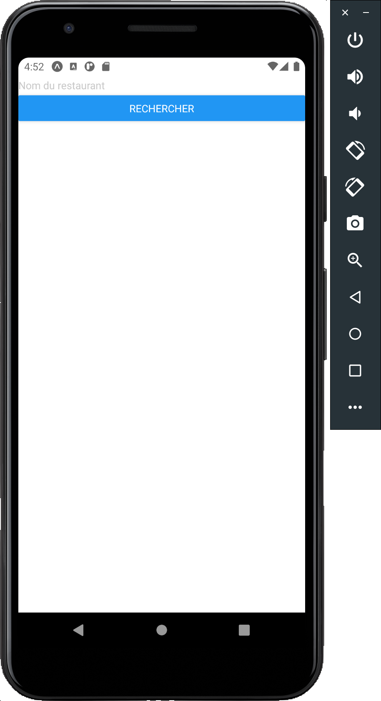

### Exercice : s'entrainer sur un composant custom

Créez un nouveau composant _Test.js_ et affichez le résultat suivant :

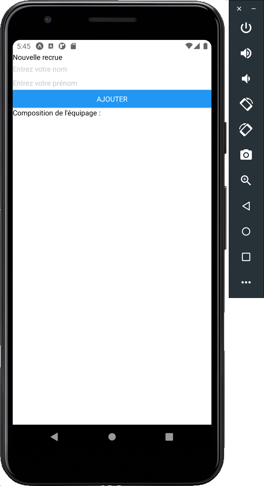

<details>
<summary>Correction</summary>

```
import React from 'react';
import { View, TextInput, Text, Button } from 'react-native';

const Test = () => {
  return (
    <View>
      <Text>
        Nouvelle recrue
      </Text>
      <TextInput placeholder='Entrez votre nom' />
      <TextInput placeholder='Entrez votre prénom' />
      <Button title='Ajouter'
        onPress={() => { }}
      />
      <Text>
        Composition de l'équipage :
      </Text>
    </View>
  );
}

export default Test;

```

</details>

## Ajouter des styles

Permettent de contrôler le rendu graphique des composants  
Première version du code :

```
<View style={{ paddingHorizontal: 12, marginTop: 16 }}>
  <TextInput
    placeholder='Nom du restaurant'
    style={{ marginBottom: 16 }}
  />
  <Button
    title='Rechercher'
    color="#6b9c68"
    onPress={() => { console.log('Coucou'); }}
  />
</View>
```

A noter que la composant _Button_ n'a pas de props _style_ (voir la doc React). Il faut donc soit utiliser une props existante (ici _color_), soit utiliser un autre composant React Native (_ToucheableOpacity_ par exemple)

Rendu :

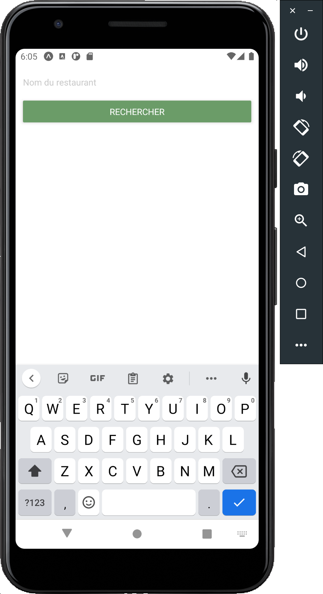

Pour améliorer la lisibilité du code, il est possible (il faut toujours faire comme ça en fait) d'externaliser les styles du composant ; il faut utiliser _StyleSheet_ :

```
import { ..., StyleSheet } from 'react-native';
```

On peut ensuite définir les styles du composant (en dehors de ce dernier, mais dans le même fichier) :

```
const styles = StyleSheet.create({
  container: {
    paddingHorizontal: 12,
    marginTop: 16,
  },
  inputRestaurantName: {
    marginBottom: 16,
  },
});
```

Et enfin les appliquer à nos éléments :

```
return (
  <View style={styles.container}>
    <TextInput
      placeholder='Nom du restaurant'
      style={styles.inputRestaurantName}
    />
    <Button
      title='Rechercher'
      color="#6b9c68"
      onPress={() => { console.log('Coucou'); }}
    />
  </View>
);
```

**Gérer les couleurs dans l'application**

La couleur de notre bouton est définie dans ce composant, mais nous allons l'utiliser à plusieurs endroits de notre application ; il faudrait donc la définir une seule fois puis pouvoir l'utiliser quand on en a besoin.  
Pour cela, on va créer un fichier unique pour gérer l'ensemble des couleurs. Commençons par créer un dossier _src/definitions_ puis un fichier _Colors.js_.  
Dans ce dernier, on va définir la couleur :

```
const Colors = {
  mainGreen: '#6b9c68',
};

export default Colors;
```

Il suffit d'importer le fichier dans notre composant pour pouvoir utiliser la couleur :

```
...
import Colors from '../definitions/Colors';
...
  <Button
    title='Rechercher'
    color={Colors.mainGreen}
    onPress={() => { console.log('Coucou'); }}
  />
...
```

<details>
<summary>Code complet</summary>

_Search.js_

```
import React from 'react';
import { View, TextInput, Button, StyleSheet } from 'react-native';

import Colors from '../definitions/Colors';

const Search = () => {

  return (
    <View style={styles.container}>
      <TextInput
        placeholder='Nom du restaurant'
        style={styles.inputRestaurantName}
      />
      <Button
        title='Rechercher'
        color={Colors.mainGreen}
        onPress={() => { console.log('Coucou'); }}
      />
    </View>
  );
};

export default Search;

const styles = StyleSheet.create({
  container: {
    paddingHorizontal: 12,
    marginTop: 16,
  },
  inputRestaurantName: {
    marginBottom: 16,
  },
});

```

</details>

### Exercice : ajouter un style au composant custom

Reprenez le composant _Test.js_ et affichez le résultat suivant :

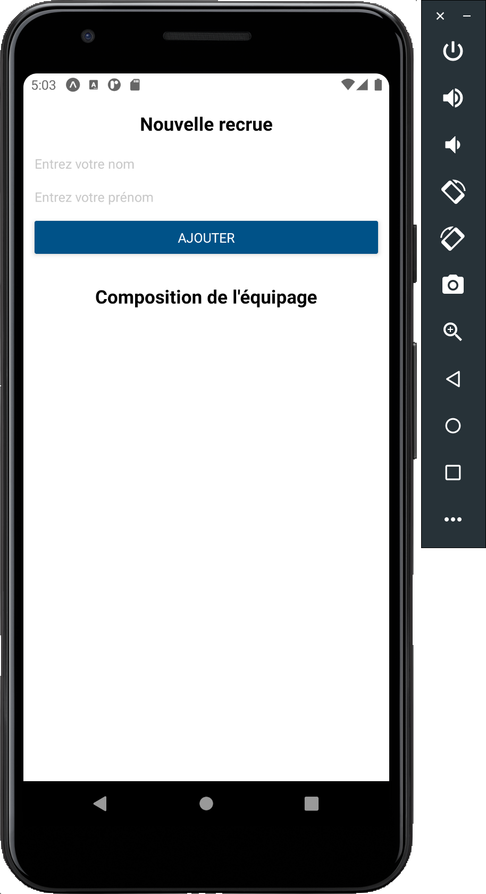

<details>
<summary>Correction</summary>

_Test.js_

```
import React from 'react';
import { View, TextInput, Text, Button, StyleSheet } from 'react-native';

const Test = () => {
  return (
    <View style={styles.container}>
      <View style={styles.subContainer}>
        <Text style={styles.title}>
          Nouvelle recrue
      </Text>
        <TextInput placeholder='Entrez votre nom'
          style={styles.form} />
        <TextInput placeholder='Entrez votre prénom'
          style={[styles.form, { marginBottom: 12 }]} />
        <Button
          title='Ajouter'
          color='#005288'
          onPress={() => { }}
        />
      </View>
      <View style={styles.subContainer}>
        <Text style={styles.title}>
          Composition de l'équipage
      </Text>
      </View>
    </View>
  );
}

export default Test;

const styles = StyleSheet.create({
  container: {
    marginHorizontal: 12,
  },
  subContainer: {
    paddingVertical: 16,
  },
  title: {
    alignSelf: "center",
    fontSize: 20,
    fontWeight: 'bold',
    marginBottom: 16,
  },
  form: {
    marginBottom: 8,
  },
});

```

</details>

### Exercice : Flexbox

Créez un composant _Test2.js_ et affichez le résultat suivant :

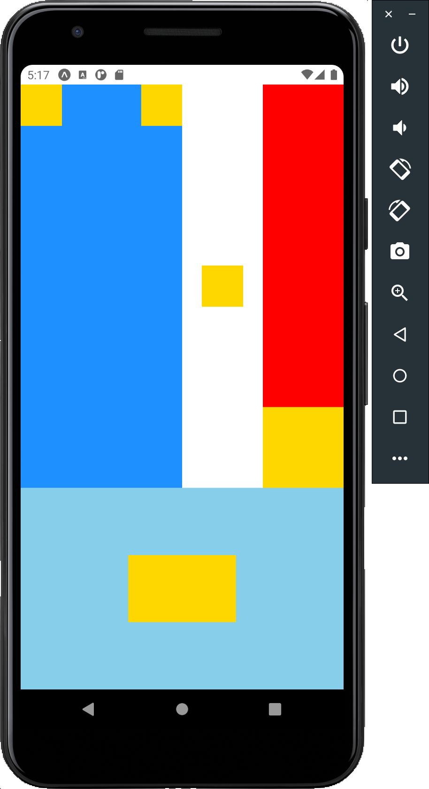

Essayez de visualiser le squelette du composant (les _boites_ dans les _boites_)

<details>
<summary>Correction</summary>

```
import React from 'react';
import { View, StyleSheet } from 'react-native';

const Test2 = () => {
  return (
    <View style={styles.mainView}>

      <View style={styles.topView}>
        <View style={styles.topSecondaryFirstView}>
          <View style={styles.topBoxViews} />
          <View style={styles.topBoxViews} />
        </View>
        <View style={styles.topSecondarySecView}>
          <View style={styles.topBoxViews} />
        </View>
        <View style={styles.topSecondaryThirdView}>
          <View style={{ flex: 4 }} />
          <View style={{ flex: 1, backgroundColor: 'gold' }} />
        </View>
      </View>

      <View style={styles.bottomView}>
        <View style={styles.bottomSecondaryViews} />
        <View style={styles.bottomSecondaryViews}>
          <View style={styles.bottomThirdViews} />
          <View style={[styles.bottomThirdViews,
          { backgroundColor: 'gold' }]} />
          <View style={styles.bottomThirdViews} />
        </View>
        <View style={styles.bottomSecondaryViews} />
      </View>

    </View>
  );
}

export default Test2;

const styles = StyleSheet.create({
  mainView: { flex: 1 },
  topView: {
    flex: 2,
    flexDirection: 'row'
  },
  topSecondaryFirstView: {
    flex: 2,
    backgroundColor: 'dodgerblue',
    flexDirection: 'row',
    justifyContent: 'space-between'
  },
  topSecondarySecView: {
    flex: 1,
    backgroundColor: 'white',
    alignItems: 'center',
    justifyContent: 'center'
  },
  topSecondaryThirdView: {
    flex: 1,
    backgroundColor: 'red',
    justifyContent: 'flex-end'
  },
  topBoxViews: {
    height: 50,
    width: 50,
    backgroundColor: 'gold'
  },
  bottomView: {
    flex: 1,
    flexDirection: 'row'
  },
  bottomSecondaryViews: {
    flex: 1,
    backgroundColor: 'skyblue'
  },
  bottomThirdViews: {
    flex: 1,
    backgroundColor: 'skyblue'
  },
});
```

</details>

## Aperçu des restaurants

### Exercice : composant pour afficher l'apercu d'un restaurant

Créez un nouveau composant _RestaurantListItem_ pour représenter un restaurant lors d'une recherche. Pour vous aider, voici quelques indications :

- taille de la maniature du restaurant : 128 / 128 ; borderRadius : 12
- taille de la police du nom du restaurant : 20 ; type de cuisines / stats : 16

Pour afficher les icones et la miniature du restaurant, utilisez le composant _Image_ de react. Pour charger le fichier à afficher il utilise une propriété _source_ (le chemin) ; dans le cas de la miniature, ne l'utilisez pas pour le moment. Pour les autres images, créez un fichier _src/definitions/Assets.js_ pour centraliser le chargement des images :

```
import iconRate from '../../assets/rate.png';
import iconReview from '../../assets/review.png';

const Assets = {
  icons: {
    rate: iconRate,
    review: iconReview,
  },
};

export default Assets;

```

Vous devez obtenir le résultat suivant :

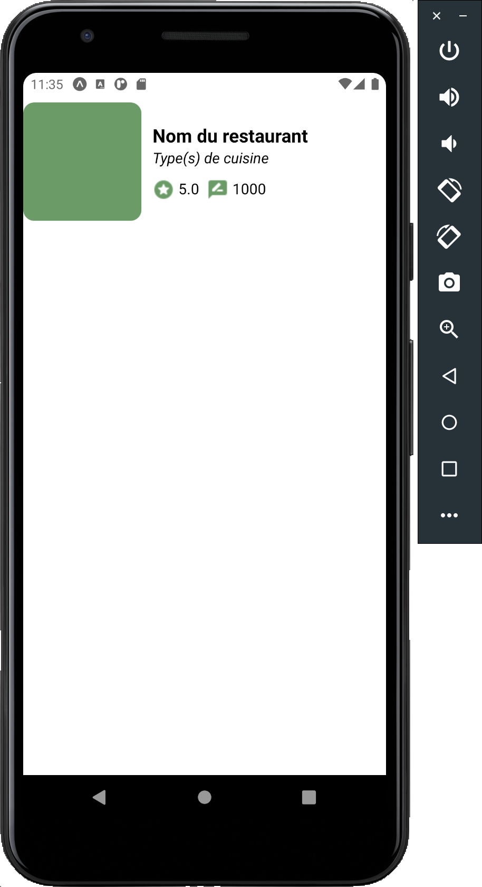

<details>
<summary>Correction</summary>

_RestaurantListItem.js_

```
import React from 'react';
import { View, StyleSheet, Image, Text } from 'react-native';

import Assets from '../definitions/Assets';
import Colors from '../definitions/Colors';

const RestaurantListItem = () => (
  <View style={styles.container}>
    <Image style={styles.thumbnail} />
    <View style={styles.informationContainer}>
      <Text style={styles.title}>
        Nom du restaurant
      </Text>
      <Text style={[styles.data, styles.cuisine]}
        numberOfLines={1}>
        Type(s) de cuisine
      </Text>
      <View style={styles.statsContainer}>
        <View style={styles.statContainer}>
          <Image style={styles.icon} source={Assets.icons.rate} />
          <Text style={[styles.data, styles.stat]}>
            5.0
          </Text>
        </View>
        <View style={styles.statContainer}>
          <Image style={styles.icon} source={Assets.icons.review} />
          <Text style={[styles.data, styles.stat]}>
            1000
          </Text>
        </View>
      </View>
    </View>
  </View>
);

export default RestaurantListItem;

const styles = StyleSheet.create({
  container: {
    flexDirection: 'row',
    paddingVertical: 8,
  },
  informationContainer: {
    flex: 1,
    marginLeft: 12,
    justifyContent: 'center',
  },
  statsContainer: {
    flexDirection: 'row',
    marginTop: 12,
  },
  statContainer: {
    flexDirection: 'row',
    marginRight: 8,
  },
  thumbnail: {
    width: 128,
    height: 128,
    borderRadius: 12,
    backgroundColor: Colors.mainGreen,
  },
  title: {
    fontSize: 20,
    fontWeight: 'bold',
  },
  data: {
    fontSize: 16,
  },
  cuisine: {
    fontStyle: 'italic',
  },
  icon: {
    tintColor: Colors.mainGreen,
  },
  stat: {
    marginLeft: 4,
  },
});

```

</details>

Rien de nouveau ici  
_numberOfLines={ 1 }_ pour la liste des types de cuisine permet de forcer le texte à s'afficher sur une ligne : si la ligne est plus longue, le texte sera coupé avec "..." affiché

### Les propriétés (props) des composants

Pour utiliser le destructuring, déclarer la liste des propriétés attendues dans le composant :

```
const Cat = ({name}) => {
  return (
    <View>
      <Text>
        Je suis {name} !
      </Text>
    </View>
  );
}

const App = () => {
  return (
    <View>
      <Cat name="Kiki"/>
    </View>
  );
}
```

Possibilité de mettre une valeur par défaut à la propriété :

```
const Cat = ({name="Chichi"}) => {
  ...

const App = () => {
  return (
    <View>
      <Cat />
    </View>
  );
}
```

Dans une application, il est conseillé de déclarer le type des propriétés attendu pour chaque composant, s'il est obligatoire ou non... Pour cela on peut utiliser TypeScript ou PropTypes (plus simple à mettre en place dans une application déjà existante)

### Exercice : utiliser des props dans le formulaire de test

Dans la page de test _Test.js_, ajoutez un composant affichant le nom et le prénom d'un membre d'équipage. Pour le moment, passez la valeur comme propriété :

```
<Text style={styles.title}>
  Composition de l'équipage
</Text>
<CrewMember firstName="John" lastName="Doe" />
```

Résultat attendu :

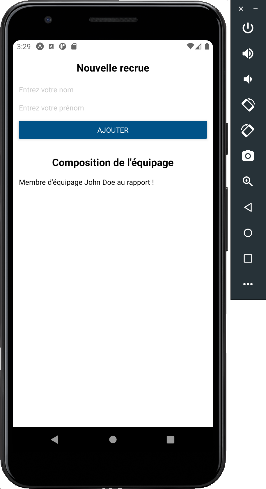

<details>
<summary>Correction</summary>

_Test.js_

```
import React from 'react';
import { View, TextInput, Text, Button, StyleSheet } from 'react-native';

const CrewMember = ({ firstName, lastName }) => {
  return (
    <View>
      <Text>
        Membre d'équipage {firstName} {lastName} au rapport !
      </Text>
    </View>
  );
}

const Test = () => {
  return (
    <View style={styles.container}>
      <View style={styles.subContainer}>
        <Text style={styles.title}>
          Nouvelle recrue
      </Text>
        <TextInput placeholder='Entrez votre nom'
          style={styles.form} />
        <TextInput placeholder='Entrez votre prénom'
          style={[styles.form, { marginBottom: 12 }]} />
        <Button
          title='Ajouter'
          color='#005288'
          onPress={() => { }}
        />
      </View>
      <View style={styles.subContainer}>
        <Text style={styles.title}>
          Composition de l'équipage
        </Text>
        <CrewMember firstName="John" lastName="Doe" />
      </View>
    </View>
  );
}

export default Test;

const styles = StyleSheet.create({
  container: {
    marginHorizontal: 12,
  },
  subContainer: {
    paddingVertical: 16,
  },
  title: {
    alignSelf: "center",
    fontSize: 20,
    fontWeight: 'bold',
    marginBottom: 16,
  },
  form: {
    marginBottom: 8,
  },
});

```

</details>

### Le state des composants

Représente la "base de données" du composant. Lorsque le state change, le composant va visuellement se rendre à nouveau. Utilisation du Hook _useState_ sous la forme :  
const [**Variable**, **Modificateur**] = useState(_ValeurParDéfaut_);

Exemple :

```
import React, { useState } from "react";
import { Button, Text, View } from "react-native";

import React, { useState } from "react";
import { Button, Text, View } from "react-native";

const Test = () => {

  const [name, setName] = useState("Paul");

  const changeName = () => {
    console.log("Current name is : " + name);
    setName("Jean");
    console.log("New name is : " + name);
  }

  return (
    <View>
      <Text>
        I am {name}
      </Text>
      <Button
        title="No, your name is Jean !"
        onPress={changeName}/>
    </View>
  );
}

```

**Attention :** modifier le state est une opération asynchrone

### Exercice : utiliser le state dans le formulaire de test

Affichez le nombre de membres d'équipage. Pour l'instant, il s'agit du nombre de fois ou le boutton "Ajouter" a été appuyé

Résultat attendu :


<details>
<summary>Correction</summary>

_Test.js_

```
import React, { useState } from 'react';
import { View, TextInput, Text, Button, StyleSheet } from 'react-native';

const CrewMember = ({ firstName, lastName }) => {
  return (
    <View>
      <Text>
        Membre d'équipage {firstName} {lastName} au rapport !
      </Text>
    </View>
  );
}

const Test = () => {

  const [crewSize, setCrewSize] = useState(0);

  return (
    <View style={styles.container}>
      <View style={styles.subContainer}>
        <Text style={styles.title}>
          Nouvelle recrue
      </Text>
        <TextInput placeholder='Entrez votre nom'
          style={styles.form} />
        <TextInput placeholder='Entrez votre prénom'
          style={[styles.form, { marginBottom: 12 }]} />
        <Button
          title='Ajouter'
          color='#005288'
          onPress={() => { setCrewSize(crewSize + 1); }}
        />
      </View>
      <View style={styles.subContainer}>
        <Text style={styles.title}>
          Composition de l'équipage ({crewSize})
        </Text>
        <CrewMember firstName="John" lastName="Doe" />
      </View>
    </View>
  );
}

export default Test;

const styles = StyleSheet.create({
  container: {
    marginHorizontal: 12,
  },
  subContainer: {
    paddingVertical: 16,
  },
  title: {
    alignSelf: "center",
    fontSize: 20,
    fontWeight: 'bold',
    marginBottom: 16,
  },
  form: {
    marginBottom: 8,
  },
});

```

</details>

### Les listes (FlatList)

3 props à passer au minimum au composant FlatList :

- data : le tableau de données (1 élément = 1 entrée dans la liste)
- keyExtractor : une fonction qui retourne la propriété à utiliser comme ID unique pour chaque élément de la liste
- renderItem : un fonction qui retourne un composant pour afficher chaque élément de la liste

Exemple :

```
const DATA = [
  { id: 'bd7acbea-c1b1-46c2-aed5-3ad53abb28ba',
    title: 'First Item'},
  { id: '3ac68afc-c605-48d3-a4f8-fbd91aa97f63',
    title: 'Second Item'},
  { id: '58694a0f-3da1-471f-bd96-145571e29d72',
    title: 'Third Item'},
];

const Item = ({ title }) => (
  <View style={styles.item}>
    <Text style={styles.title}>{title}</Text>
  </View>
);

const App = () => {

  return (
    <View style={styles.container}>
      <FlatList
        data={DATA}
        renderItem={ ({ item }) => <Item title={item.title}/> }
        keyExtractor={item => item.id}
      />
    </View>
  );
}

```

### Exercice : la liste des membres d'équipage

Vous avez maintenant tous les éléments nécessaires pour gérer correctement la liste des membres d'équipage. Lors d'un clique sur le bouton _Ajouter_, si les deux champs du formulaire sont remplis un nouveau membre est ajouté à la liste. Pensez également à gérer de la bonne manière l'affichage du nombre de personnes dans l'équipage.  
Pensez à regarder la documentation des composants pour vous aider. Pour l'ID, générez un string unique avec _Date.now().toString()_

Rendu attendu :

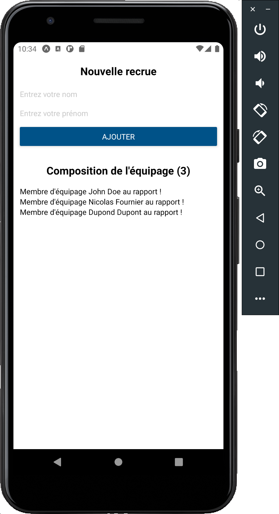

<details>
<summary>Correction</summary>

_Test.js_

```
import React, { useState } from 'react';
import { View, TextInput, Text, Button, StyleSheet, FlatList } from 'react-native';

const CrewMember = ({ firstName, lastName }) => {
  return (
    <View>
      <Text>
        Membre d'équipage {firstName} {lastName} au rapport !
      </Text>
    </View>
  );
}

const Test = () => {

  const [crews, setCrews] = useState([]);
  const [firstName, setFirstName] = useState('');
  const [lastName, setLastName] = useState('');

  const addCrewMember = () => {
    if (firstName && lastName) {
      setCrews([...crews, { id: Date.now().toString(), firstName: firstName, lastName: lastName }]);
    }
  }

  return (
    <View style={styles.container}>
      <View style={styles.subContainer}>
        <Text style={styles.title}>
          Nouvelle recrue
      </Text>
        <TextInput placeholder='Entrez votre nom'
          style={styles.form}
          onChangeText={(text) => setLastName(text)} />
        <TextInput placeholder='Entrez votre prénom'
          style={[styles.form, { marginBottom: 12 }]}
          onChangeText={(text) => setFirstName(text)} />
        <Button
          title='Ajouter'
          color='#005288'
          onPress={addCrewMember}
        />
      </View>
      <View style={styles.subContainer}>
        <Text style={styles.title}>
          Composition de l'équipage ({crews.length})
        </Text>
        <FlatList
          data={crews}
          keyExtractor={(item) => item.id}
          renderItem={({ item }) => (
            <CrewMember firstName={item.firstName} lastName={item.lastName} />)}
        />
      </View>
    </View>
  );
}

export default Test;

const styles = StyleSheet.create({
  container: {
    marginHorizontal: 12,
  },
  subContainer: {
    paddingVertical: 16,
  },
  title: {
    alignSelf: "center",
    fontSize: 20,
    fontWeight: 'bold',
    marginBottom: 16,
  },
  form: {
    marginBottom: 8,
  },
});

```

</details>

### Créer la liste des restaurants

Nous pouvons maintenant reprendre notre application de restaurants et appliquer ce que nous avons vu (props, state et liste) dans le composant _Search_. Pour le moment nous allons utiliser de fausses données (par la suite elle nous les récupèrerons d'une API)

Créez le fichier _src/helpers/fakeRestaurants.js_ et copiez le contenu suivant :

<details>
<summary>Code</summary>

```
const fakeRestaurants = [
  {
    restaurant: {
      id: 16774318,
      name: 'La mama Pizza',
      average_cost: 15,
      user_rating: {
        aggregate_rating: 3.7,
        votes: 1063,
      },
      cuisines: 'Cafes, Italian',
    },
  },
  {
    restaurant: {
      id: 16774319,
      name: 'Le soleil du desert',
      average_cost: 25,
      user_rating: {
        aggregate_rating: 4.9,
        votes: 333,
      },
      cuisines: 'Middle Eastern, Moroccan',
    },
  },
  {
    restaurant: {
      id: 16774320,
      name: 'Le noodle',
      average_cost: 10,
      user_rating: {
        aggregate_rating: 4.1,
        votes: 1380,
      },
      cuisines: 'Asian, Ramen',
    },
  },
];

export default fakeRestaurants;

```

</details>

Votre objectif est d'afficher cette liste de restaurants dans le composant Search. Je vous conseil de procéder en 2 étapes :

- mettre en place la liste pour afficher le bon nombre d'objets _RestaurantListItem_
- modifier le composant _RestaurantListItem_ pour lui passer les props afin d'afficher les bonnes données

Dans le composant _RestaurantListItem_, je vous déconseil de déclarer chaque props ; passez plutôt l'objet contenant toutes les données :

```
const RestaurantListItem = ({ restaurantData}) => {
```

Rendu attendu :

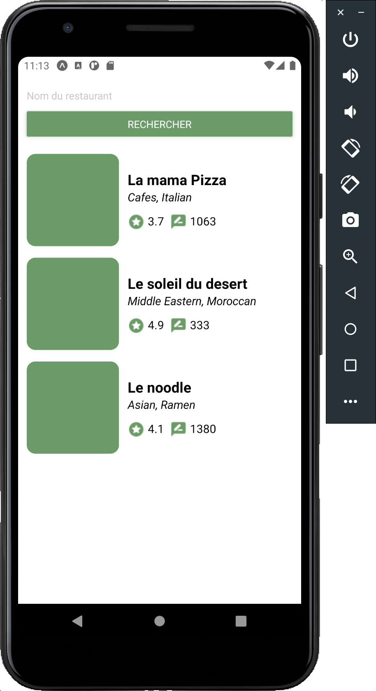

<details>
<summary>Correction</summary>

_Search.js_

```
import React, { useState } from 'react';
import { View, TextInput, Button, StyleSheet, FlatList } from 'react-native';

import RestaurantlistItem from '../components/RestaurantListItem';

import Colors from '../definitions/Colors';
import fakeRestaurants from '../helpers/fakeRestaurants';

const Search = () => {

  const [restaurants, setRestaurants] = useState(fakeRestaurants);

  return (
    <View style={styles.container}>
      <View style={styles.searchContainer}>
        <TextInput
          placeholder='Nom du restaurant'
          style={styles.inputRestaurantName}
        />
        <Button
          title='Rechercher'
          color={Colors.mainGreen}
          onPress={() => { console.log('Coucou'); }}
        />
      </View>
      <FlatList
        data={restaurants}
        keyExtractor={(item) => item.restaurant.id.toString()}
        renderItem={({ item }) => (
          <RestaurantlistItem restaurantData={item.restaurant} />
        )}
      />
    </View>
  );
};

export default Search;

const styles = StyleSheet.create({
  container: {
    flex: 1,
    paddingHorizontal: 12,
    marginTop: 16,
  },
  searchContainer: {
    marginBottom: 16,
  },
  inputRestaurantName: {
    marginBottom: 8,
  },
});

```

_RestaurantListItem.js_

```
import React from 'react';
import { View, StyleSheet, Image, Text } from 'react-native';

import Assets from '../definitions/Assets';
import Colors from '../definitions/Colors';

const RestaurantListItem = ({ restaurantData, restaurantData: { user_rating } }) => (
  <View style={styles.container}>
    <Image style={styles.thumbnail} />
    <View style={styles.informationContainer}>
      <Text style={styles.title}>
        {restaurantData.name}
      </Text>
      <Text style={[styles.data, styles.cuisine]}
        numberOfLines={1}>
        {restaurantData.cuisines}
      </Text>
      <View style={styles.statsContainer}>
        <View style={styles.statContainer}>
          <Image style={styles.icon} source={Assets.icons.rate} />
          <Text style={[styles.data, styles.stat]}>
            {user_rating.aggregate_rating}
          </Text>
        </View>
        <View style={styles.statContainer}>
          <Image style={styles.icon} source={Assets.icons.review} />
          <Text style={[styles.data, styles.stat]}>
            {user_rating.votes}
          </Text>
        </View>
      </View>
    </View>
  </View>
);

export default RestaurantListItem;

const styles = StyleSheet.create({
  container: {
    flexDirection: 'row',
    paddingVertical: 8,
  },
  informationContainer: {
    flex: 1,
    marginLeft: 12,
    justifyContent: 'center',
  },
  statsContainer: {
    flexDirection: 'row',
    marginTop: 12,
  },
  statContainer: {
    flexDirection: 'row',
    marginRight: 8,
  },
  thumbnail: {
    width: 128,
    height: 128,
    borderRadius: 12,
    backgroundColor: Colors.mainGreen,
  },
  title: {
    fontSize: 20,
    fontWeight: 'bold',
  },
  data: {
    fontSize: 16,
  },
  cuisine: {
    fontStyle: 'italic',
  },
  icon: {
    tintColor: Colors.mainGreen,
  },
  stat: {
    marginLeft: 4,
  },
});

```

</details>

Afin d'alléger mon code dans le JSX, j'ai profité du destructuring pour assigner une variable supplémentaire contenant l'objet _user_rating_ pour le manipuler directement :

```
const RestaurantItem = ( {restaurant, restaurant : {user_rating}} ) => {
  ...
  <Text style={ styles.restaurantDataText }>
              { user_rating.aggregate_rating }
  </Text>
  ...
  <Text style={ styles.restaurantDataText }>
              { user_rating.votes }
  </Text>
  ...
```

Au lieu de :

```
...
<Text style={ styles.restaurantDataText }>
            { restaurant.user_rating.aggregate_rating }
</Text>
...
<Text style={ styles.restaurantDataText }>
            { restaurant.user_rating.votes }
</Text>
```

### Requêtes internet : fetch

Exemple de call en utilisant l'api fetch :

```
const getMoviesFromApiAsync = async () => {
  try {
    const response = await fetch('https://reactnative.dev/movies.json');
    const json = await response.json();
    return json.movies;
  } catch (error) {
    console.error(error);
  }
};

```

Eléments importants :

- fetch est asynchrone ; on doit attendre le retour de la fonction (utilisation des mots clés _await/async_)
- pour traiter la réponse, il est plus simple de convertir en format json
- bien penser à mettre le tout dans un _try/catch_ et gérer les erreurs

Utilisation :

```
export default App = () => {
  const [data, setData] = useState([]);

  const loadData = async () => {
    const res = await getMoviesFromApiAsync();
    setData(res);
    console.log(res);
  }

  return (
    <View style={{ flex: 1, padding: 24 }}>
      <Button
        title="load"
        onPress={loadData}/>
      <FlatList
        data={data}
        keyExtractor={({ id }, index) => id}
        renderItem={({ item }) => (
          <Text>{item.title}, {item.releaseYear}</Text>) }
        />
    </View>
  );
};

```

L'API _fetch_ permet de gérer bien plus de paramètres pour les requêtes (la méthode, les headers...) en fonction des besoins. Regardez la documentation pour plus d'infos

### Récupérer les restaurants depuis l'API Zomato

Votre prochaine mission est de remplacer les fausses données des restaurants par un appel à l'API Zomato. On va utiliser la requête _/search_ sur la ville de Londres  
Créez un fichier src/api/zomato.js\* pour centraliser les requêtes à l'API Zomato. Sauvegardez votre clé ainsi que l'ID de la ville de Londres :

```
const API_KEY = '';
const LONDON_ID = 61;
```

A l'aide de la documentation, regardez comment construire la requête ; les paramètres attendu (et le header), le retour... afin de charger les restaurants de la ville de Londres. Créez la fonction dans le fichier _zomato.js_ et utilisez la dans le composant _Search_ lors d'un appui sur le bouton de recherche pour peupler la liste. Ne prennez pour l'instant pas en compte la pagination ou le texte de recherche

Vous devriez obtenir un résultat semblable à ceci après un appui sur la recherche :

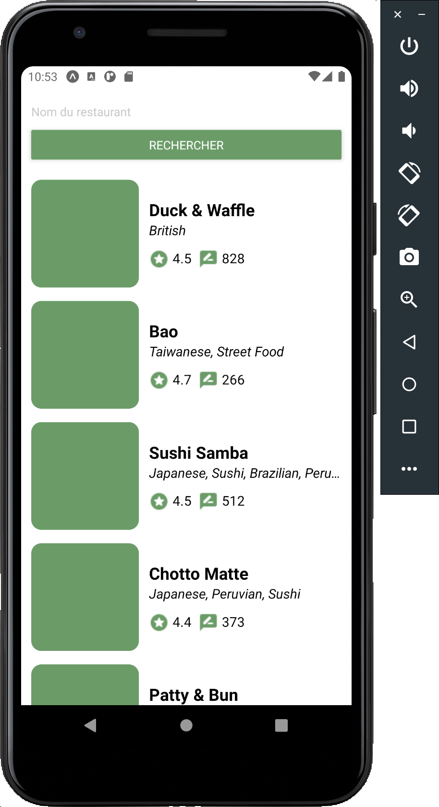

<details>
<summary>Correction</summary>

_zomato.js_

```
const API_KEY = '';
const LONDON_ID = '61';

export async function getRestaurants() {
  try {
    const myHeaders = new Headers({ 'user-key': API_KEY });
    const url = `https://developers.zomato.com/api/v2.1/search?entity_id=${LONDON_ID}&entity_type=city`;
    const response = await fetch(url, { headers: myHeaders });
    const json = await response.json();
    return json;
  } catch (error) {
    console.log(`Error with function getRestaurants ${error.message}`);
    throw error;
  }
};

```

_Search.js_

```
import React, { useState } from 'react';
import { View, TextInput, Button, StyleSheet, FlatList } from 'react-native';

import RestaurantlistItem from '../components/RestaurantListItem';

import Colors from '../definitions/Colors';

import { getRestaurants } from '../api/zomato';

const Search = () => {

  const [restaurants, setRestaurants] = useState([]);

  const searchRestaurants = async () => {
    try {
      const zomatoSearchResult = await getRestaurants();
      setRestaurants(zomatoSearchResult.restaurants);
    } catch (error) {

    }
  }

  return (
    <View style={styles.container}>
      <View style={styles.searchContainer}>
        <TextInput
          placeholder='Nom du restaurant'
          style={styles.inputRestaurantName}
        />
        <Button
          title='Rechercher'
          color={Colors.mainGreen}
          onPress={searchRestaurants}
        />
      </View>
      <FlatList
        data={restaurants}
        keyExtractor={(item) => item.restaurant.id.toString()}
        renderItem={({ item }) => (
          <RestaurantlistItem restaurantData={item.restaurant} />
        )}
      />
    </View>
  );
};

export default Search;

const styles = StyleSheet.create({
  container: {
    flex: 1,
    paddingHorizontal: 12,
    marginTop: 16,
  },
  searchContainer: {
    marginBottom: 16,
  },
  inputRestaurantName: {
    marginBottom: 8,
  },
});

```

</details>

### Utiliser le texte de recherche

Jusqu'à présent, la recherche des restaurants se fait sans paramètres. Vous avez tout à disposition pour ajouter cette fonctionnalité !

Rendu attendu :

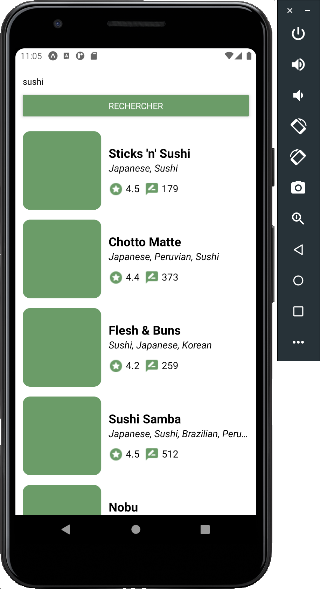

<details>
<summary>Correction</summary>

_zomato.js_

```
const API_KEY = '';
const LONDON_ID = '61';

export async function getRestaurants(searchTerm = '') {
  try {
    const myHeaders = new Headers({ 'user-key': API_KEY });
    const url = `https://developers.zomato.com/api/v2.1/search?entity_id=${LONDON_ID}&entity_type=city&q=${searchTerm}`;
    const response = await fetch(url, { headers: myHeaders });
    const json = await response.json();
    return json;
  } catch (error) {
    console.log(`Error with function getRestaurants ${error.message}`);
    throw error;
  }
};

```

_Search.js_

```
import React, { useState } from 'react';
import { View, TextInput, Button, StyleSheet, FlatList } from 'react-native';

import RestaurantlistItem from '../components/RestaurantListItem';

import Colors from '../definitions/Colors';

import { getRestaurants } from '../api/zomato';

const Search = () => {

  const [restaurants, setRestaurants] = useState([]);
  const [searchTerm, setSearchTerm] = useState('');

  const searchRestaurants = async () => {
    try {
      const zomatoSearchResult = await getRestaurants(searchTerm);
      setRestaurants(zomatoSearchResult.restaurants);
    } catch (error) {

    }
  }

  return (
    <View style={styles.container}>
      <View style={styles.searchContainer}>
        <TextInput
          placeholder='Nom du restaurant'
          style={styles.inputRestaurantName}
          onChangeText={(text) => setSearchTerm(text)}
        />
        <Button
          title='Rechercher'
          color={Colors.mainGreen}
          onPress={searchRestaurants}
        />
      </View>
      <FlatList
        data={restaurants}
        keyExtractor={(item) => item.restaurant.id.toString()}
        renderItem={({ item }) => (
          <RestaurantlistItem restaurantData={item.restaurant} />
        )}
      />
    </View>
  );
};

export default Search;

const styles = StyleSheet.create({
  container: {
    flex: 1,
    paddingHorizontal: 12,
    marginTop: 16,
  },
  searchContainer: {
    marginBottom: 16,
  },
  inputRestaurantName: {
    marginBottom: 8,
  },
});

```

</details>

### Récupérer plus de résultats

L'API zomato renvoie au maximum 20 résultats à chaque requête. Il faudrait que lorsque l'utilisateur scroll sur le bas de la liste, s'il reste des résultats à charger l'application fasse une nouvelle requête à l'API

Première étape, voir comment l'API Zomato gère la pagination. Dans la documentation, on trouve ceci : _(start) fetch results after offset_. Il est possible de spécifier à partir de quel élément on souhaite obtenir les résultats. Vous pourrez donc modifier la requête pour prendre en compte ce paramêtre  
De plus, en observant le retour de la requête à _/search_, on peut observer les informations nécessaires à la pagination :

```
{
  "results_found": 28692,
  "results_start": 0,
  "results_shown": 20,
  "restaurants": [ ...
  ]
}
```

Seconde étape, détecter lorsque l'utilisateur arrive en bas de la liste pour charger d'avantage de résultats. La documentation de FlatList nous donne les deux infos suivantes :

- **onEndReached** (function): call when the scroll position gets within onEndReachedThreshold of the rendered content
- **onEndReachedThreshold** (number): How far from the end (in units of visible length of the list) the bottom edge of the list must be from the end of the content to trigger the onEndReached callback. Thus a value of 0.5 will trigger onEndReached when the end of the content is within half the visible length of the list

Pour faire simple, la fonction définie dans la propriété _onEndReached_ sera appelée lorsque l'utilisateur attendra la fin de la liste - la taille d'écran défini dans _onEndReachedThreshold_ (en pratique, definissez cette valeur à 0.5)  
On peut donc faire :

```
...
_loadMoreRestaurants = () => {
  console.log("End of the list");
}
...
      <FlatList
        data={ restaurants }
        keyExtractor={ (item) => item.restaurant.id.toString() }
        renderItem={ ({item}) => <RestaurantItem
                                    restaurant={ item.restaurant }
                                 /> }
        onEndReached={ _loadMoreRestaurants }
        onEndReachedThreshold={ 0.5 }
      />
```

Lorsque vous arrivez en bas de la liste, vous devriez avoir un log dans la console

On avance ! Il faudrait maintenant :

- stocker les variables de pagination ; offset actuel et s'il y a plus de résultats (pour ne pas faire de call s'il n'y a plus de résultats)
- initialiser / réinitialiser ces variables à chaque nouvelle recherche (lors de l'appui sur le bouton)
- lorsque l'utilisateur arrive en fin de liste, si besoin effectuer un nouvel appel à l'API (et bien mettre à jour les variables)

Vous êtes capable d'effectuer toutes ces étapes. N'oubliez pas que modifier le state est asynchrone, qu'il faut parfois ajouter les anciens résultats et parfois tout remettre à 0...

<details>
<summary>Correction</summary>

_zomato.js_

```
const API_KEY = '';
const LONDON_ID = '61';

export async function getRestaurants(searchTerm = '', offset = 0) {
  try {
    const myHeaders = new Headers({ 'user-key': API_KEY });
    const url = `https://developers.zomato.com/api/v2.1/search?entity_id=${LONDON_ID}&entity_type=city&start=${offset}&q=${searchTerm}`;
    const response = await fetch(url, { headers: myHeaders });
    const json = await response.json();
    return json;
  } catch (error) {
    console.log(`Error with function getRestaurants ${error.message}`);
    throw error;
  }
};

```

_Search.js_

```
import React, { useState } from 'react';
import { View, TextInput, Button, StyleSheet, FlatList } from 'react-native';

import RestaurantlistItem from '../components/RestaurantListItem';

import Colors from '../definitions/Colors';

import { getRestaurants } from '../api/zomato';

const Search = () => {

  const [restaurants, setRestaurants] = useState([]);
  const [searchTerm, setSearchTerm] = useState('');
  const [nextOffset, setNextOffset] = useState(0);
  const [isMoreResults, setIsMoreResults] = useState(true);

  const requestRestaurants = async (prevRestaurants, offset) => {
    try {
      const zomatoSearchResult = await getRestaurants(searchTerm, offset);
      setRestaurants([...prevRestaurants, ...zomatoSearchResult.restaurants]);
      if (zomatoSearchResult.results_start + zomatoSearchResult.results_shown < zomatoSearchResult.results_found) {
        setIsMoreResults(true);
        setNextOffset(zomatoSearchResult.results_start + zomatoSearchResult.results_shown);
      } else {
        setIsMoreResults(false);
      }
    } catch (error) {
    }
  };

  const searchRestaurants = () => {
    requestRestaurants([], 0);
  };

  const loadMoreRestaurants = () => {
    if (isMoreResults) {
      requestRestaurants(restaurants, nextOffset);
    };
  };

  return (
    <View style={styles.container}>
      <View style={styles.searchContainer}>
        <TextInput
          placeholder='Nom du restaurant'
          style={styles.inputRestaurantName}
          onChangeText={(text) => setSearchTerm(text)}
        />
        <Button
          title='Rechercher'
          color={Colors.mainGreen}
          onPress={searchRestaurants}
        />
      </View>
      <FlatList
        data={restaurants}
        keyExtractor={(item) => item.restaurant.id.toString()}
        renderItem={({ item }) => (
          <RestaurantlistItem restaurantData={item.restaurant} />
        )}
        onEndReached={loadMoreRestaurants}
        onEndReachedThreshold={0.5}
      />
    </View>
  );
};

export default Search;

const styles = StyleSheet.create({
  container: {
    flex: 1,
    paddingHorizontal: 12,
    marginTop: 16,
  },
  searchContainer: {
    marginBottom: 16,
  },
  inputRestaurantName: {
    marginBottom: 8,
  },
});

```

</details>

_Limitation de l'API Zomato : en version gratuite, on ne peut pas obtenir les résultats après 100 éléments retournés. Si je commence ma requête à l'élément 101, j'obtiendrai un tableau vide en retour_

### Ajout de quelques fonctionnalités

#### Icone de chargement + Pull to resfresh

Le retour du call à l'API n'est pas instantané. Pendant ces quelques secondes, il ne se passe rien à l'écran : ce n'est vraiment pas une bonne expérience utilisateur. Il faudrait que la liste affiche une icône de chargement pendant que l'API retourne le résultat. Nous pouvons également implémenter une fonctionnalité de _pull to resfresh_  
La documentation de FlatList nous renseigne sur 2 props : _refreshing_ et _onRefresh_

Commportement attendu :

- lors d'une requête à l'API, la liste affiche une icone de chargement
- si l'utilisateur utilise le _pull to refresh_, une nouvelle requête est émise (comme s'il appuyait sur le bouton)

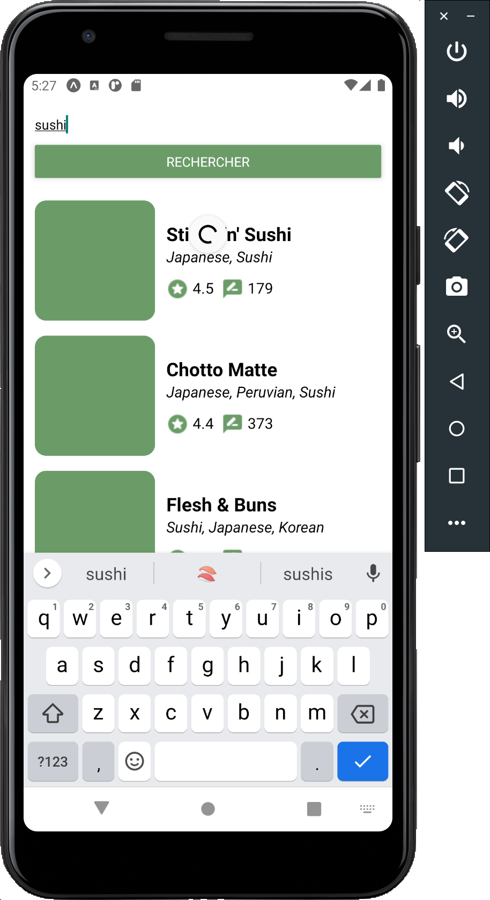

<details>
<summary>Correction</summary>

_Search.js_

```
import React, { useState } from 'react';
import { View, TextInput, Button, StyleSheet, FlatList } from 'react-native';

import RestaurantlistItem from '../components/RestaurantListItem';

import Colors from '../definitions/Colors';

import { getRestaurants } from '../api/zomato';

const Search = () => {

  const [restaurants, setRestaurants] = useState([]);
  const [searchTerm, setSearchTerm] = useState('');
  const [nextOffset, setNextOffset] = useState(0);
  const [isMoreResults, setIsMoreResults] = useState(true);
  const [isRefreshing, setIsRefreshing] = useState(false);

  const requestRestaurants = async (prevRestaurants, offset) => {
    setIsRefreshing(true);
    try {
      const zomatoSearchResult = await getRestaurants(searchTerm, offset);
      setRestaurants([...prevRestaurants, ...zomatoSearchResult.restaurants]);
      if (zomatoSearchResult.results_start + zomatoSearchResult.results_shown < zomatoSearchResult.results_found) {
        setIsMoreResults(true);
        setNextOffset(zomatoSearchResult.results_start + zomatoSearchResult.results_shown);
      } else {
        setIsMoreResults(false);
      }
    } catch (error) {
    }
    setIsRefreshing(false);
  };

  const searchRestaurants = () => {
    requestRestaurants([], 0);
  };

  const loadMoreRestaurants = () => {
    if (isMoreResults) {
      requestRestaurants(restaurants, nextOffset);
    };
  };

  return (
    <View style={styles.container}>
      <View style={styles.searchContainer}>
        <TextInput
          placeholder='Nom du restaurant'
          style={styles.inputRestaurantName}
          onChangeText={(text) => setSearchTerm(text)}
        />
        <Button
          title='Rechercher'
          color={Colors.mainGreen}
          onPress={searchRestaurants}
        />
      </View>
      <FlatList
        data={restaurants}
        keyExtractor={(item) => item.restaurant.id.toString()}
        renderItem={({ item }) => (
          <RestaurantlistItem restaurantData={item.restaurant} />
        )}
        onEndReached={loadMoreRestaurants}
        onEndReachedThreshold={0.5}
        refreshing={isRefreshing}
        onRefresh={searchRestaurants}
      />
    </View>
  );
};

export default Search;

const styles = StyleSheet.create({
  container: {
    flex: 1,
    paddingHorizontal: 12,
    marginTop: 16,
  },
  searchContainer: {
    marginBottom: 16,
  },
  inputRestaurantName: {
    marginBottom: 8,
  },
});

```

*Petit bug de React Native : utiliser la propriété *refreshing* de la FlatList sans définir la propriété *onRefresh* ne fonctionne pas*

</details>

#### Affichage en cas d'erreur lors du call API

Actuellement nous ne traitons pas les erreurs lors du call API. Le comportement attendu est le suivant :

- Si je n'ai pas d'erreur, comportement actuel (affichage de la liste de restaurants)
- Si j'ai une erreur lors du call :
  - remise à 0 des données
  - la liste est remplacée par un autre composant affichant un message d'erreur

La seule chose que vous ne savez pour l'instant pas faire, c'est un affichage conditionnel dans le JSX. Rien de bien compliqué :

```
{ isError ? (
    // Afficher le composant erreur ici
  ) : (
    <FlatList
      ...
    />
)}
```

Faite bien un composant séparé pour afficher l'erreur (_src/components/DisplayError.js_), pour qu'il puisse être réutilisé par la suite. Le mieux est même que ce composant prenne en props le message d'erreur à afficher. Pour tester le comportement, vous pouvez simplement toujours retourner une erreur dans la fonction qui effectue la requête

Résultat attendu :

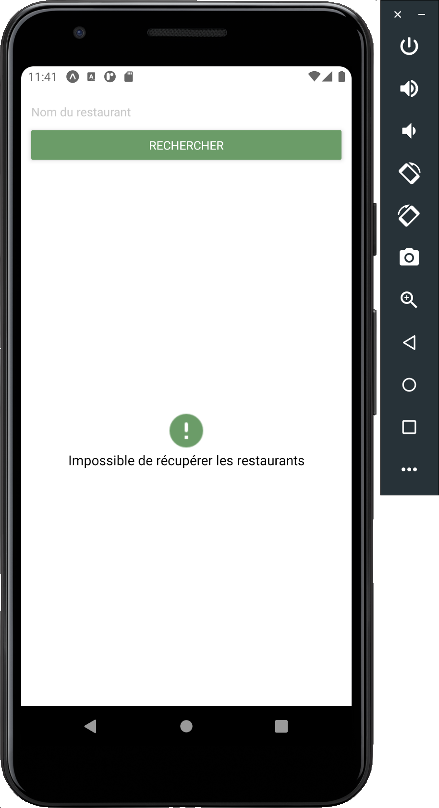

<details>
<summary>Correction</summary>

_Assets.js_

```
import iconRate from '../../assets/rate.png';
import iconReview from '../../assets/review.png';
import iconError from '../../assets/error.png';

const Assets = {
  icons: {
    rate: iconRate,
    review: iconReview,
    error: iconError,
  },
};

export default Assets;

```

_DisplayError.js_

```
import React from 'react';
import { View, StyleSheet, Text, Image } from 'react-native';

import Assets from '../definitions/Assets';
import Colors from '../definitions/Colors';

const DisplayError = ({ message = "Une erreur c'est produite" }) => (
  <View style={styles.container}>
    <Image source={Assets.icons.error} style={styles.icon} />
    <Text style={styles.errorText}>
      {message}
    </Text>
  </View>
);

export default DisplayError;

const styles = StyleSheet.create({
  container: {
    flex: 1,
    alignItems: 'center',
    justifyContent: 'center',
  },
  icon: {
    tintColor: Colors.mainGreen,
  },
  errorText: {
    fontSize: 16,
  },
});

```

_Search.js_

```
import React, { useState } from 'react';
import { View, TextInput, Button, StyleSheet, FlatList } from 'react-native';

import RestaurantlistItem from '../components/RestaurantListItem';
import DisplayError from '../components/DisplayError';

import Colors from '../definitions/Colors';

import { getRestaurants } from '../api/zomato';

const Search = () => {

  const [restaurants, setRestaurants] = useState([]);
  const [searchTerm, setSearchTerm] = useState('');
  const [nextOffset, setNextOffset] = useState(0);
  const [isMoreResults, setIsMoreResults] = useState(true);
  const [isRefreshing, setIsRefreshing] = useState(false);
  const [isError, setIsError] = useState(false);

  const requestRestaurants = async (prevRestaurants, offset) => {
    setIsRefreshing(true);
    setIsError(false);
    try {
      const zomatoSearchResult = await getRestaurants(searchTerm, offset);
      setRestaurants([...prevRestaurants, ...zomatoSearchResult.restaurants]);
      if (zomatoSearchResult.results_start + zomatoSearchResult.results_shown < zomatoSearchResult.results_found) {
        setIsMoreResults(true);
        setNextOffset(zomatoSearchResult.results_start + zomatoSearchResult.results_shown);
      } else {
        setIsMoreResults(false);
      }
    } catch (error) {
      setIsError(true);
      setRestaurants([]);
      setIsMoreResults(true);
      setNextOffset(0);
    }
    setIsRefreshing(false);
  };

  const searchRestaurants = () => {
    requestRestaurants([], 0);
  };

  const loadMoreRestaurants = () => {
    if (isMoreResults) {
      requestRestaurants(restaurants, nextOffset);
    };
  };

  return (
    <View style={styles.container}>
      <View style={styles.searchContainer}>
        <TextInput
          placeholder='Nom du restaurant'
          style={styles.inputRestaurantName}
          onChangeText={(text) => setSearchTerm(text)}
        />
        <Button
          title='Rechercher'
          color={Colors.mainGreen}
          onPress={searchRestaurants}
        />
      </View>
      {
        isError ?
          (<DisplayError message='Impossible de récupérer les restaurants' />) :
          (<FlatList
            data={restaurants}
            keyExtractor={(item) => item.restaurant.id.toString()}
            renderItem={({ item }) => (
              <RestaurantlistItem restaurantData={item.restaurant} />
            )}
            onEndReached={loadMoreRestaurants}
            onEndReachedThreshold={0.5}
            refreshing={isRefreshing}
            onRefresh={searchRestaurants}
          />)
      }
    </View>
  );
};

export default Search;

const styles = StyleSheet.create({
  container: {
    flex: 1,
    paddingHorizontal: 12,
    marginTop: 16,
  },
  searchContainer: {
    marginBottom: 16,
  },
  inputRestaurantName: {
    marginBottom: 8,
  },
});

```

Pour faire les choses vraiment bien, on aurait du gérer le type d'erreur retourné pour afficher le bon message à l'utilisateur (service indisponible, erreur réseau etc...). Il est très important, surtout dans les applications mobile, d'avoir un feedback utilisateur le plus précis possible

</details>

#### Améliorer le clavier

2 fonctionnalités à ajouter sur le clavier :

- lancer la recherche avec le bouton "OK"
- fermer le clavier lorsqu'une recherche est lancée

<details>
<summary>Correction</summary>

_Search.js_

```
import React, { useState } from 'react';
import { View, TextInput, Button, StyleSheet, FlatList, Keyboard } from 'react-native';

import RestaurantlistItem from '../components/RestaurantListItem';
import DisplayError from '../components/DisplayError';

import Colors from '../definitions/Colors';

import { getRestaurants } from '../api/zomato';

const Search = () => {

  const [restaurants, setRestaurants] = useState([]);
  const [searchTerm, setSearchTerm] = useState('');
  const [nextOffset, setNextOffset] = useState(0);
  const [isMoreResults, setIsMoreResults] = useState(true);
  const [isRefreshing, setIsRefreshing] = useState(false);
  const [isError, setIsError] = useState(false);

  const requestRestaurants = async (prevRestaurants, offset) => {
    setIsRefreshing(true);
    setIsError(false);
    try {
      const zomatoSearchResult = await getRestaurants(searchTerm, offset);
      setRestaurants([...prevRestaurants, ...zomatoSearchResult.restaurants]);
      if (zomatoSearchResult.results_start + zomatoSearchResult.results_shown < zomatoSearchResult.results_found) {
        setIsMoreResults(true);
        setNextOffset(zomatoSearchResult.results_start + zomatoSearchResult.results_shown);
      } else {
        setIsMoreResults(false);
      }
    } catch (error) {
      setIsError(true);
      setRestaurants([]);
      setIsMoreResults(true);
      setNextOffset(0);
    }
    setIsRefreshing(false);
  };

  const searchRestaurants = () => {
    Keyboard.dismiss();
    requestRestaurants([], 0);
  };

  const loadMoreRestaurants = () => {
    if (isMoreResults) {
      requestRestaurants(restaurants, nextOffset);
    };
  };

  return (
    <View style={styles.container}>
      <View style={styles.searchContainer}>
        <TextInput
          placeholder='Nom du restaurant'
          style={styles.inputRestaurantName}
          onChangeText={(text) => setSearchTerm(text)}
          onSubmitEditing={searchRestaurants}
        />
        <Button
          title='Rechercher'
          color={Colors.mainGreen}
          onPress={searchRestaurants}
        />
      </View>
      {
        isError ?
          (<DisplayError message='Impossible de récupérer les restaurants' />) :
          (<FlatList
            data={restaurants}
            keyExtractor={(item) => item.restaurant.id.toString()}
            renderItem={({ item }) => (
              <RestaurantlistItem restaurantData={item.restaurant} />
            )}
            onEndReached={loadMoreRestaurants}
            onEndReachedThreshold={0.5}
            refreshing={isRefreshing}
            onRefresh={searchRestaurants}
          />)
      }
    </View>
  );
};

export default Search;

const styles = StyleSheet.create({
  container: {
    flex: 1,
    paddingHorizontal: 12,
    marginTop: 16,
  },
  searchContainer: {
    marginBottom: 16,
  },
  inputRestaurantName: {
    marginBottom: 8,
  },
});

```

</details>

#### Affichage de l'image du restaurant

Il est temps d'ajouter le vrai aperçu des restaurants. Chaque objet restaurant renvoyé par Zomato contient la propriété suivante :

```
"thumb": "https://b.zmtcdn.com/data/res_imagery/6114718_CHAIN_4a57080b96c0041bce378791a73d7395_c.JPG?fit=around%7C200%3A200&crop=200%3A200%3B%2A%2C%2A"
```

La documentation du composant _Image_ indique qu'il est possible de charger la source depuis internet comme ceci :

```
<Image
  source={{
    uri: 'https://reactnative.dev/img/tiny_logo.png',
  }}
/>
```

Le problème est que les restaurants de Zomato ne contiennent pas tous de miniature. L'application ne va pas s'arrêter si URI est vide mais va retourner un warning. Il faudrait donc avoir le comportement suivant :

- si une miniature existe, l'afficher
- sinon, avoir une icone pour la remplacer

Mettez en place ce comportement. Voici un indice pour gérer l'affichage :

```
  const getThumbnail = () => {
    if (restaurantData.thumb) {
      return (
        ...
      );
    };
    return (
      ...
    );
  };

  return (
    <View style={styles.container}>
      {getThumbnail()}
      <View style={styles.informationContainer}>
        ...
```

Résultat attendu :

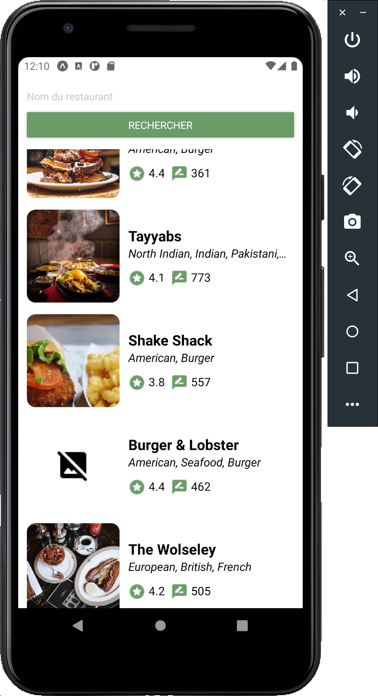

<details>
<summary>Correction</summary>

_Assets.js_

```
import iconRate from '../../assets/rate.png';
import iconReview from '../../assets/review.png';
import iconError from '../../assets/error.png';
import iconMissingIMG from '../../assets/missingImage.png';

const Assets = {
  icons: {
    rate: iconRate,
    review: iconReview,
    error: iconError,
    missingIMG: iconMissingIMG,
  },
};

export default Assets;

```

_RestaurantListItem.js_

```
import React from 'react';
import { View, StyleSheet, Image, Text } from 'react-native';

import Assets from '../definitions/Assets';
import Colors from '../definitions/Colors';


const RestaurantListItem = ({ restaurantData, restaurantData: { user_rating } }) => {

  const getThumbnail = () => {
    if (restaurantData.thumb) {
      return (
        <Image style={styles.thumbnail} source={{ uri: restaurantData.thumb }} />
      );
    };
    return (
      <View style={styles.noThumbnailContainer}>
        <Image source={Assets.icons.missingIMG} />
      </View>
    );
  }

  return (
    <View style={styles.container}>
      {getThumbnail()}
      <View style={styles.informationContainer}>
        <Text style={styles.title}>
          {restaurantData.name}
        </Text>
        <Text style={[styles.data, styles.cuisine]}
          numberOfLines={1}>
          {restaurantData.cuisines}
        </Text>
        <View style={styles.statsContainer}>
          <View style={styles.statContainer}>
            <Image style={styles.icon} source={Assets.icons.rate} />
            <Text style={[styles.data, styles.stat]}>
              {user_rating.aggregate_rating}
            </Text>
          </View>
          <View style={styles.statContainer}>
            <Image style={styles.icon} source={Assets.icons.review} />
            <Text style={[styles.data, styles.stat]}>
              {user_rating.votes}
            </Text>
          </View>
        </View>
      </View>
    </View>
  );
};

export default RestaurantListItem;

const styles = StyleSheet.create({
  container: {
    flexDirection: 'row',
    paddingVertical: 8,
  },
  informationContainer: {
    flex: 1,
    marginLeft: 12,
    justifyContent: 'center',
  },
  statsContainer: {
    flexDirection: 'row',
    marginTop: 12,
  },
  statContainer: {
    flexDirection: 'row',
    marginRight: 8,
  },
  noThumbnailContainer: {
    width: 128,
    height: 128,
    alignItems: 'center',
    justifyContent: 'center',
  },
  thumbnail: {
    width: 128,
    height: 128,
    borderRadius: 12,
    backgroundColor: Colors.mainGreen,
  },
  title: {
    fontSize: 20,
    fontWeight: 'bold',
  },
  data: {
    fontSize: 16,
  },
  cuisine: {
    fontStyle: 'italic',
  },
  icon: {
    tintColor: Colors.mainGreen,
  },
  stat: {
    marginLeft: 4,
  },
});

```

</details>

## Détails d'un restaurant

### React navigation

Installation :

```
npm install @react-navigation/native
expo install react-native-gesture-handler react-native-reanimated react-native-screens react-native-safe-area-context @react-native-community/masked-view
npm install @react-navigation/stack
```

Créer un _StackNavigator_ :

```
const StackNavigator = createStackNavigator();

function RootStack() {
  return (
    <StackNavigator.Navigator
      initialRouteName="ScreenName1"
    >
      <StackNavigator.Screen
        name="ScreenName1"
        component={Screen}
      />
      ...
    </StackNavigator.Navigator>
  );
}

export default RootStack;
```

Mise en place :

```
export default function App() {
  return (
    <NavigationContainer>
      <RootStack /> // composant importé
      ...
    </NavigationContainer>
  );
}
```

Navigation :

```
// Pour naviguer vers un autre écran, utilisez la prop 'navigate'
navigation.navigate('screenName', {
  paramName: paramValue,
  ...
});

//Pour récupérer les paramètres, utilisez la prop 'route'
const { paramName } = route.params;
```

### Naviguer de l'aperçu à la page d'un restaurant

Votre prochain objectif est de mettre en place le comportement suivant : lorsque l'utilisateur clique sur un élément de la liste, il navigue vers une nouvelle page. Pour résumer, voici les étapes à effectuer :

- Créez un nouveau composant _Restaurant_
- Modifiez le composant _RestaurantListItem_ pour détecter un clic utilisateur
- Mettez en place la structure de React Navigation
- Branchez le tout pour avoir le comportement attendu

La détection du clic sur un item d'une FlatList n'est pas natif. Voici comment réaliser cette partie :

- Modifiez le composant _View_ global par le composant _ToucheableOpacity_ dans _RestaurantListItem_
- Passez depuis la liste du composant _Search_ la fonction permettant la navigation à chaque item
- Récupérez la fonction et éxécutez la lors d'un clic

Résultat attendu :

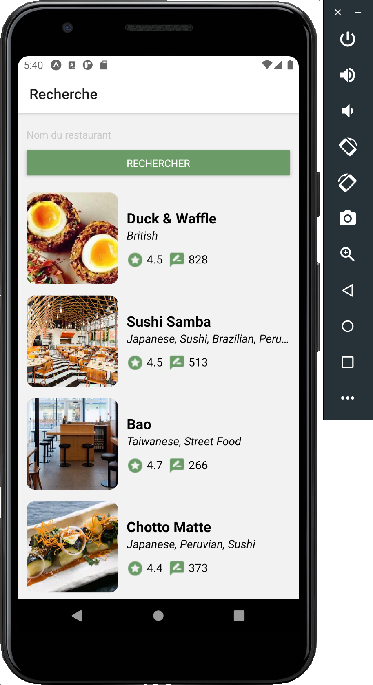
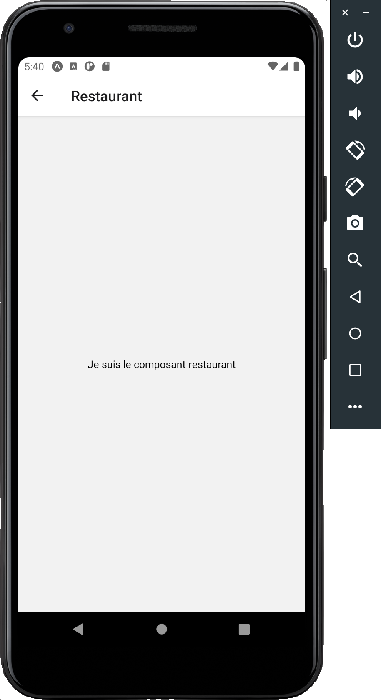

<details>
<summary>Correction</summary>

_Restaurant.js_

```
import React from 'react';
import { View, StyleSheet, Text } from 'react-native';

const Restaurant = () => {
  return (
    <View style={styles.container}>
      <Text>
        Je suis le composant restaurant
      </Text>
    </View>
  )
};

export default Restaurant;

const styles = StyleSheet.create({
  container: {
    flex: 1,
    alignItems: 'center',
    justifyContent: 'center',
  },
});

```

_RestaurantListItem.js_

```
import React from 'react';
import { View, StyleSheet, Image, Text, TouchableOpacity } from 'react-native';

import Assets from '../definitions/Assets';
import Colors from '../definitions/Colors';


const RestaurantListItem = ({ onClick, restaurantData, restaurantData: { user_rating } }) => {

  const getThumbnail = () => {
    if (restaurantData.thumb) {
      return (
        <Image style={styles.thumbnail} source={{ uri: restaurantData.thumb }} />
      );
    };
    return (
      <View style={styles.noThumbnailContainer}>
        <Image source={Assets.icons.missingIMG} />
      </View>
    );
  };

  return (
    <TouchableOpacity style={styles.container} onPress={onClick}>
      {getThumbnail()}
      <View style={styles.informationContainer}>
        <Text style={styles.title}>
          {restaurantData.name}
        </Text>
        <Text style={[styles.data, styles.cuisine]}
          numberOfLines={1}>
          {restaurantData.cuisines}
        </Text>
        <View style={styles.statsContainer}>
          <View style={styles.statContainer}>
            <Image style={styles.icon} source={Assets.icons.rate} />
            <Text style={[styles.data, styles.stat]}>
              {user_rating.aggregate_rating}
            </Text>
          </View>
          <View style={styles.statContainer}>
            <Image style={styles.icon} source={Assets.icons.review} />
            <Text style={[styles.data, styles.stat]}>
              {user_rating.votes}
            </Text>
          </View>
        </View>
      </View>
    </TouchableOpacity>
  );
};

export default RestaurantListItem;

const styles = StyleSheet.create({
  container: {
    flexDirection: 'row',
    paddingVertical: 8,
  },
  informationContainer: {
    flex: 1,
    marginLeft: 12,
    justifyContent: 'center',
  },
  statsContainer: {
    flexDirection: 'row',
    marginTop: 12,
  },
  statContainer: {
    flexDirection: 'row',
    marginRight: 8,
  },
  noThumbnailContainer: {
    width: 128,
    height: 128,
    alignItems: 'center',
    justifyContent: 'center',
  },
  thumbnail: {
    width: 128,
    height: 128,
    borderRadius: 12,
    backgroundColor: Colors.mainGreen,
  },
  title: {
    fontSize: 20,
    fontWeight: 'bold',
  },
  data: {
    fontSize: 16,
  },
  cuisine: {
    fontStyle: 'italic',
  },
  icon: {
    tintColor: Colors.mainGreen,
  },
  stat: {
    marginLeft: 4,
  },
});

```

_Search.js_

```
import React, { useState } from 'react';
import { View, TextInput, Button, StyleSheet, FlatList, Keyboard } from 'react-native';

import RestaurantlistItem from '../components/RestaurantListItem';
import DisplayError from '../components/DisplayError';

import Colors from '../definitions/Colors';

import { getRestaurants } from '../api/zomato';

const Search = ({ navigation }) => {

  const [restaurants, setRestaurants] = useState([]);
  const [searchTerm, setSearchTerm] = useState('');
  const [nextOffset, setNextOffset] = useState(0);
  const [isMoreResults, setIsMoreResults] = useState(true);
  const [isRefreshing, setIsRefreshing] = useState(false);
  const [isError, setIsError] = useState(false);

  const requestRestaurants = async (prevRestaurants, offset) => {
    setIsRefreshing(true);
    setIsError(false);
    try {
      const zomatoSearchResult = await getRestaurants(searchTerm, offset);
      setRestaurants([...prevRestaurants, ...zomatoSearchResult.restaurants]);
      if (zomatoSearchResult.results_start + zomatoSearchResult.results_shown < zomatoSearchResult.results_found) {
        setIsMoreResults(true);
        setNextOffset(zomatoSearchResult.results_start + zomatoSearchResult.results_shown);
      } else {
        setIsMoreResults(false);
      }
    } catch (error) {
      setIsError(true);
      setRestaurants([]);
      setIsMoreResults(true);
      setNextOffset(0);
    }
    setIsRefreshing(false);
  };

  const searchRestaurants = () => {
    Keyboard.dismiss();
    requestRestaurants([], 0);
  };

  const loadMoreRestaurants = () => {
    if (isMoreResults) {
      requestRestaurants(restaurants, nextOffset);
    };
  };

  const navigateToRestaurantDetails = () => {
    navigation.navigate("ViewRestaurant");
  };

  return (
    <View style={styles.container}>
      <View style={styles.searchContainer}>
        <TextInput
          placeholder='Nom du restaurant'
          style={styles.inputRestaurantName}
          onChangeText={(text) => setSearchTerm(text)}
          onSubmitEditing={searchRestaurants}
        />
        <Button
          title='Rechercher'
          color={Colors.mainGreen}
          onPress={searchRestaurants}
        />
      </View>
      {
        isError ?
          (<DisplayError message='Impossible de récupérer les restaurants' />) :
          (<FlatList
            data={restaurants}
            keyExtractor={(item) => item.restaurant.id.toString()}
            renderItem={({ item }) => (
              <RestaurantlistItem restaurantData={item.restaurant} onClick={navigateToRestaurantDetails} />
            )}
            onEndReached={loadMoreRestaurants}
            onEndReachedThreshold={0.5}
            refreshing={isRefreshing}
            onRefresh={searchRestaurants}
          />)
      }
    </View>
  );
};

export default Search;

const styles = StyleSheet.create({
  container: {
    flex: 1,
    paddingHorizontal: 12,
    marginTop: 16,
  },
  searchContainer: {
    marginBottom: 16,
  },
  inputRestaurantName: {
    marginBottom: 8,
  },
});

```

_navigation/Navigation.js_

```
import React from 'react';
import { createStackNavigator } from '@react-navigation/stack';

import Search from '../components/Search';
import Restaurant from '../components/Restaurant';

const SearchNavigation = createStackNavigator();

function RootStack() {
  return (
    <SearchNavigation.Navigator
      initialRouteName="ViewSearch"
    >
      <SearchNavigation.Screen
        name="ViewSearch"
        component={Search}
        options={{ title: 'Recherche' }}
      />
      <SearchNavigation.Screen
        name="ViewRestaurant"
        component={Restaurant}
        options={{ title: 'Restaurant' }}
      />
    </SearchNavigation.Navigator>
  );
}

export default RootStack;

```

_App.js_

```
import { StatusBar } from 'expo-status-bar';
import React from 'react';
import { StyleSheet, View, Text } from 'react-native';
import { NavigationContainer } from '@react-navigation/native';

import Navigation from './src/navigation/Navigation';
import Search from './src/components/Search';
import Test from './src/components/Test';
import Test2 from './src/components/Test2';
import RestaurantListItem from './src/components/RestaurantListItem'

export default function App() {
  return (
    <NavigationContainer>
      <Navigation />
      <StatusBar style="auto" />
    </NavigationContainer>
  );
}

```

</details>

### Effets de bord et cycle de vie

Les effets de bord sont des évènements communs dans la vie d'un composant ; par exemple charger des données depuis internet afin de les afficher, "s'abonner" à un service pour être notifié d'un changement de valeur, etc... Il existe 2 types d'effets de bord :

- sans nettoyage ; par exemple au chargement du composant il doit faire une requête pour récupérer des données à afficher
- avec nettoyage ; par exemple au chargement du composant ce dernier doit s'abonner à un service pour être prévenu d'un changement, et lorsque le composant se détruit il doit se désabonner du service

Avec les Hooks de React, les effets de bord sont gérés via la fonction _useEffect_

Exemple sans nettoyage ; à chaque fois que le composant va s'afficher (donc à _l'initialisation (montage)_ ainsi qu'à chaque refresh) le code sera exécuté :

```
useEffect(() => {
  // Met à jour le titre du document via l’API du navigateur
  document.title = `Vous avez cliqué ${count} fois`;
});
```

Exemple avec nettoyage ; à chaque fois que le composant va s'afficher (donc à l'initialisation ainsi qu'à chaque refresh) le code sera exécuté + au moment ou le composant va se _détruire (démonter)_ la fonction du _return_ sera exécutée :

```
useEffect(() => {
  // Code classique du useEffect
  function handleStatusChange(status) {
    setIsOnline(status.isOnline);
  }
  ChatAPI.subscribeToFriendStatus(props.friend.id, handleStatusChange);
  // Indique comment nettoyer l'effet :
  return function cleanup() { // Le nom de la fonction n'a pas d'importance
    ChatAPI.unsubscribeFromFriendStatus(props.friend.id, handleStatusChange);
  };
});
```

Comme nous venons de le voir, _useEffect_ est appelé à chaque fois que le composant se met à jour. Un comportement standard est de ne vouloir exécuter la fonction que lorsqu'une ou plusieurs données changent :

```
useEffect(() => {
  document.title = `Vous avez cliqué ${count} fois`;
}, [count]); // N’exécute l’effet que si count a changé
```

Un dérivé très utilisé et de vouloir effectuer un _useEffect_ uniquement à l'initialisation du composant :

```
useEffect(() => {
  document.title = loadData();
}, []); // N’exécute l’effet que lors de l'initialisation
```

### Récupérer les données du restaurant

L'objectif de la nouvelle page est d'afficher les informations d'un restaurant ; il faut donc charger ses données depuis l'API (pour l'instant uniquement son nom). Voici le comportement à mettre en place ainsi que des indications :

- Ajoutez une fonction dans _zomato.js_ prennant en paramètre l'id d'un restaurant pour récupérer les données (regardez la doc)
- Passez l'id du restaurant en paramètre de la navigation à la page des détails du restaurant
- Mettez en place le chargement de la page du restaurant :
  - Affichez un loader à l'arrivé sur la page (composant _ActivityIndicator_)
  - Un fois que le composant React est initialisé, faire un call API pour récupérer les données du restaurant (via _UseEffect_)
  - Une fois les données du restaurant récupérées, arrétez d'afficher le loader et affichez le nom du restaurant (ou le composant d'erreur si échec du call)

Rappel : pourquoi ne pas mettre le call API dans le _useState_ ?  
Le retour de l'API est incertain ; nous ne savons pas quand il va revenir ni même s'il va revenir. De plus il faut être certain que le composant a fini de s'initialiser avant de vouloir le modifier

Résultat attendu :

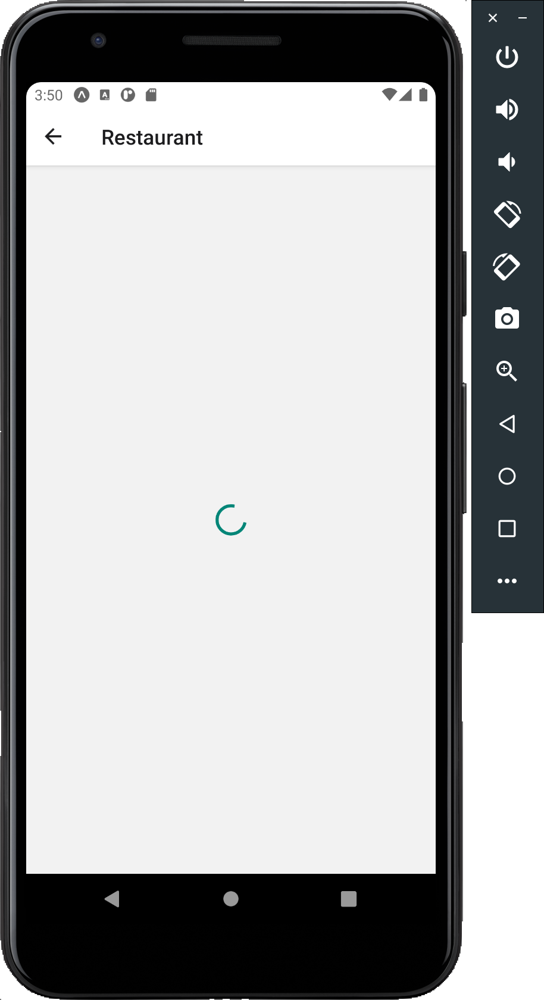
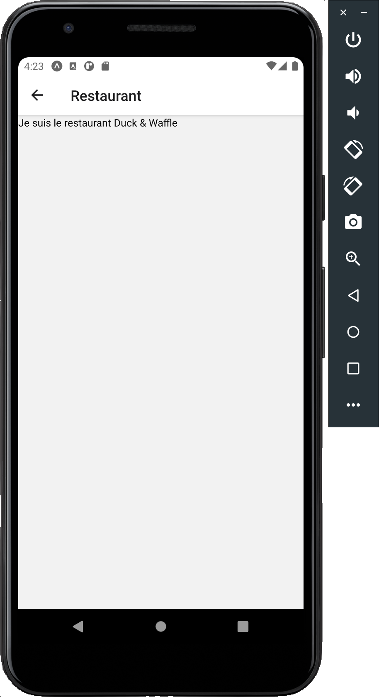

<details>
<summary>Correction</summary>

_zomato.js_

```
...

export async function getRestaurantDetails(restaurantID) {
  try {
    const myHeaders = new Headers({ 'user-key': API_KEY });
    const url = `https://developers.zomato.com/api/v2.1/restaurant?res_id=${restaurantID}`;
    const response = await fetch(url, { headers: myHeaders });
    const json = await response.json();
    return json;
  } catch (error) {
    console.log(`Error with function getRestaurantDetails ${error.message}`);
    throw error;
  }
};
```

_RestaurantListItem.js_

```
import React from 'react';
import { View, StyleSheet, Image, Text, TouchableOpacity } from 'react-native';

import Assets from '../definitions/Assets';
import Colors from '../definitions/Colors';


const RestaurantListItem = ({ onClick, restaurantData, restaurantData: { user_rating } }) => {

  const getThumbnail = () => {
    if (restaurantData.thumb) {
      return (
        <Image style={styles.thumbnail} source={{ uri: restaurantData.thumb }} />
      );
    };
    return (
      <View style={styles.noThumbnailContainer}>
        <Image source={Assets.icons.missingIMG} />
      </View>
    );
  };

  return (
    <TouchableOpacity style={styles.container}
      onPress={() => { onClick(restaurantData.id) }}>
      {getThumbnail()}
      <View style={styles.informationContainer}>
        <Text style={styles.title}>
          {restaurantData.name}
        </Text>
        <Text style={[styles.data, styles.cuisine]}
          numberOfLines={1}>
          {restaurantData.cuisines}
        </Text>
        <View style={styles.statsContainer}>
          <View style={styles.statContainer}>
            <Image style={styles.icon} source={Assets.icons.rate} />
            <Text style={[styles.data, styles.stat]}>
              {user_rating.aggregate_rating}
            </Text>
          </View>
          <View style={styles.statContainer}>
            <Image style={styles.icon} source={Assets.icons.review} />
            <Text style={[styles.data, styles.stat]}>
              {user_rating.votes}
            </Text>
          </View>
        </View>
      </View>
    </TouchableOpacity>
  );
};

export default RestaurantListItem;

const styles = StyleSheet.create({
  container: {
    flexDirection: 'row',
    paddingVertical: 8,
  },
  informationContainer: {
    flex: 1,
    marginLeft: 12,
    justifyContent: 'center',
  },
  statsContainer: {
    flexDirection: 'row',
    marginTop: 12,
  },
  statContainer: {
    flexDirection: 'row',
    marginRight: 8,
  },
  noThumbnailContainer: {
    width: 128,
    height: 128,
    alignItems: 'center',
    justifyContent: 'center',
  },
  thumbnail: {
    width: 128,
    height: 128,
    borderRadius: 12,
    backgroundColor: Colors.mainGreen,
  },
  title: {
    fontSize: 20,
    fontWeight: 'bold',
  },
  data: {
    fontSize: 16,
  },
  cuisine: {
    fontStyle: 'italic',
  },
  icon: {
    tintColor: Colors.mainGreen,
  },
  stat: {
    marginLeft: 4,
  },
});

```

_Search.js_

```
import React, { useState } from 'react';
import { View, TextInput, Button, StyleSheet, FlatList, Keyboard } from 'react-native';

import RestaurantlistItem from '../components/RestaurantListItem';
import DisplayError from '../components/DisplayError';

import Colors from '../definitions/Colors';

import { getRestaurants } from '../api/zomato';

const Search = ({ navigation }) => {

  const [restaurants, setRestaurants] = useState([]);
  const [searchTerm, setSearchTerm] = useState('');
  const [nextOffset, setNextOffset] = useState(0);
  const [isMoreResults, setIsMoreResults] = useState(true);
  const [isRefreshing, setIsRefreshing] = useState(false);
  const [isError, setIsError] = useState(false);

  const requestRestaurants = async (prevRestaurants, offset) => {
    setIsRefreshing(true);
    setIsError(false);
    try {
      const zomatoSearchResult = await getRestaurants(searchTerm, offset);
      setRestaurants([...prevRestaurants, ...zomatoSearchResult.restaurants]);
      if (zomatoSearchResult.results_start + zomatoSearchResult.results_shown < zomatoSearchResult.results_found) {
        setIsMoreResults(true);
        setNextOffset(zomatoSearchResult.results_start + zomatoSearchResult.results_shown);
      } else {
        setIsMoreResults(false);
      }
    } catch (error) {
      setIsError(true);
      setRestaurants([]);
      setIsMoreResults(true);
      setNextOffset(0);
    }
    setIsRefreshing(false);
  };

  const searchRestaurants = () => {
    Keyboard.dismiss();
    requestRestaurants([], 0);
  };

  const loadMoreRestaurants = () => {
    if (isMoreResults) {
      requestRestaurants(restaurants, nextOffset);
    };
  };

  const navigateToRestaurantDetails = (restaurantID) => {
    navigation.navigate("ViewRestaurant", { restaurantID });
  };

  return (
    <View style={styles.container}>
      <View style={styles.searchContainer}>
        <TextInput
          placeholder='Nom du restaurant'
          style={styles.inputRestaurantName}
          onChangeText={(text) => setSearchTerm(text)}
          onSubmitEditing={searchRestaurants}
        />
        <Button
          title='Rechercher'
          color={Colors.mainGreen}
          onPress={searchRestaurants}
        />
      </View>
      {
        isError ?
          (<DisplayError message='Impossible de récupérer les restaurants' />) :
          (<FlatList
            data={restaurants}
            keyExtractor={(item) => item.restaurant.id.toString()}
            renderItem={({ item }) => (
              <RestaurantlistItem restaurantData={item.restaurant} onClick={navigateToRestaurantDetails} />
            )}
            onEndReached={loadMoreRestaurants}
            onEndReachedThreshold={0.5}
            refreshing={isRefreshing}
            onRefresh={searchRestaurants}
          />)
      }
    </View>
  );
};

export default Search;

const styles = StyleSheet.create({
  container: {
    flex: 1,
    paddingHorizontal: 12,
    marginTop: 16,
  },
  searchContainer: {
    marginBottom: 16,
  },
  inputRestaurantName: {
    marginBottom: 8,
  },
});

```

_Restaurant.js_

```
import React, { useState, useEffect } from 'react';
import { View, StyleSheet, Text, ActivityIndicator } from 'react-native';
import DisplayError from '../components/DisplayError';

import { getRestaurantDetails } from '../api/zomato';

const Restaurant = ({ route }) => {
  const [isLoading, setIsLoading] = useState(true);
  const [restaurant, setRestaurant] = useState(null);
  const [isError, setIsError] = useState(false);

  useEffect(() => {
    requestRestaurant();
  }, []); // Uniquement à l'initialisation

  // Pourrait être directement déclarée dans useEffect
  const requestRestaurant = async () => {
    try {
      const zomatoRestaurantResult = await getRestaurantDetails(route.params.restaurantID);
      setRestaurant(zomatoRestaurantResult);
      setIsLoading(false);
    } catch (error) {
      setIsError(true);
    }
  }

  return (
    <View style={styles.container}>
      {isError ?
        (<DisplayError message='Impossible de récupérer les données du restaurants' />) :
        (isLoading ?
          (<View style={styles.containerLoading}>
            <ActivityIndicator size="large" />
          </View>) :
          (<Text>
            Je suis le restaurant {restaurant.name}
          </Text>)
        )}
    </View>
  );
};

export default Restaurant;

const styles = StyleSheet.create({
  container: {
    flex: 1,
  },
  containerLoading: {
    flex: 1,
    justifyContent: 'center',
    alignItems: 'center',
  }
});

```

</details>

### Réalisation de l'interface

Maintenant que la logique de la page du restaurant est en place, il ne reste plus qu'à réaliser l'interface. Comme souvent, cette étape n'est pas la plus compliquée mais prend pas mal de temps ; c'est un bon exercice pour appliquer ce que vous avez appris. Petites nouveautés ici :

- comment afficher la liste des horaires d'ouverture ?
- comment faire si le contenu ne tient pas sur un écran en hauteur ?
- comment afficher la bonne couleur pour la note (renvoyée par l'API) ?

Résultat attendu :

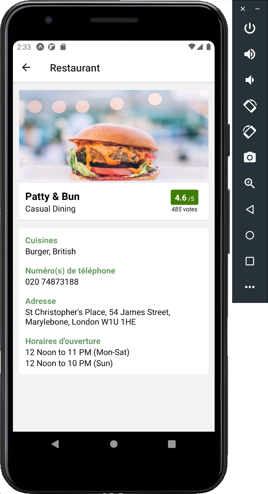
